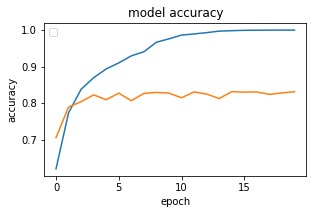
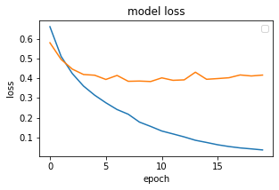

# Sentiment Analysis using Deep Learning in Keras

### Dataset Source

- [IMDB Dataset](https://www.kaggle.com/lakshmi25npathi/imdb-dataset-of-50k-movie-reviews)
- [Twitter sentiment analysis](https://github.com/vineetdhanawat/twitter-sentiment-analysis/blob/master/datasets/Sentiment%20Analysis%20Dataset%20100000.csv)
- [glove.6B.100d.txt Dataset](https://www.kaggle.com/danielwillgeorge/glove6b100dtxt)


## Model Used

### Machine Learning
- SVM

### Deep Learning
1. Simple Neural Network
2. CNN
3. GRU
4. LSTM
5. Bi-directional LSTM

**Notes: CNN performed well.**

## Performance (CNN) 

<table>
  <tr>
    <td>Accuracy CNN</td>
    <td>Loss CNN</td>
  </tr>
  <tr>
    <td></td>
    <td></td>
  </tr>
 </table>

### Some prediction (CNN)

```python
predictions(["This is very bad. You should not do this."])
```
    'negative'
```python
predictions(["I am very happy to hear that."])
```
    'positive'
```python
predictions(["Wow! You look so beautiful."])
```
    'positive'
